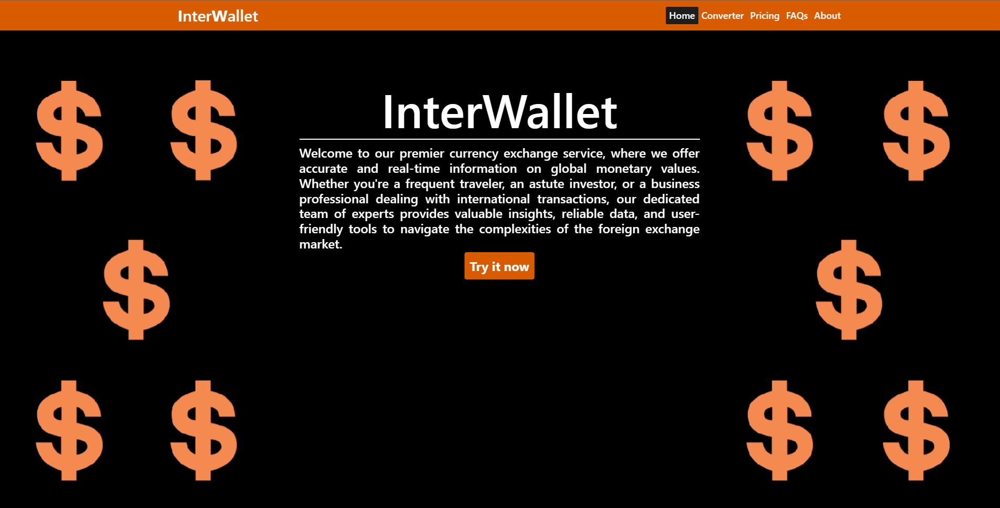

# Conversor Moedas Web

Projeto em andamento...

## Sobre
Site de conversão de moedas através do consumo de uma API de terceiros

Projeto criado com [Angular CLI](https://github.com/angular/angular-cli) versão 16.1.6.

## 💻 Tecnologias
        	 

## Execução

Digite `ng serve` for a executar a aplicação. Após isso digite a seguinte na url `http://localhost:4200/`. Isso fará com que a aplicação atualize caso tenha alguma modificação nos arquivos.
